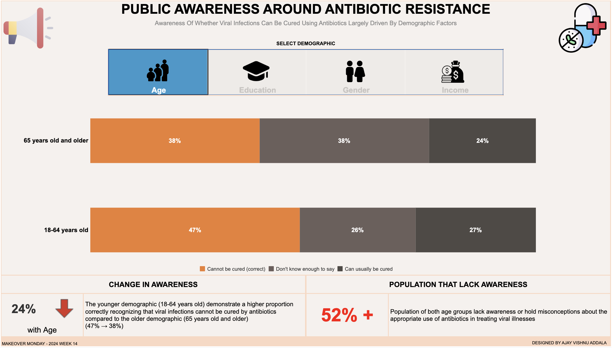

# Public Awareness Around Antibiotic Resistance Dashboard

## Overview

This Tableau dashboard explores whether viral infections can be cured using antibiotics, focusing on various demographic factors such as age, income, gender, and education. The dashboard provides insights into how awareness varies across different sub-categories within each demographic group. It highlights the percentage of the population that holds misconceptions or lacks information about antibiotics.

## Dashboard Snapshot

## Dashboard Link

You can access the interactive Tableau dashboard [here]([link_to_dashboard](https://public.tableau.com/views/PublicAwarenessaroundAntibioticResistanceMOM2024Week14/VaccinationAwareness?:language=en-US&publish=yes&:sid=&:display_count=n&:origin=viz_share_link)).

## Data Source

The data used for this analysis was obtained from the Makeover Monday challenge. It includes responses from a survey conducted to assess public awareness of antibiotic resistance and the appropriate use of antibiotics.

## Dashboard Interactivity

The dashboard offers interactivity through dropdown menus or filters, allowing users to switch between different demographic factors (age, income, gender, education) and explore how awareness varies within each category. Users can also hover over data points to view specific percentages and insights.

## Inferences

- **Age**: Older individuals tend to have less awareness of antibiotic efficacy against viral infections than younger age groups. However, older demographics exhibit higher uncertainty or misconceptions.
- **Income**: Higher income levels correlate with a better understanding of antibiotic efficacy against viral infections, with lower-income individuals more likely to express uncertainty or hold misconceptions.
- **Gender**: Women generally exhibit a higher level of awareness compared to men, but both genders show a notable portion with misconceptions or lack of information about antibiotics.
- **Education**: Higher levels of education are associated with a better understanding of antibiotic efficacy against viral infections, with individuals holding at least a college degree showing the highest awareness.

## Conclusion

The dashboard highlights the importance of targeted awareness campaigns and education initiatives to address misconceptions and improve public knowledge about antibiotic resistance and appropriate antibiotic use.

